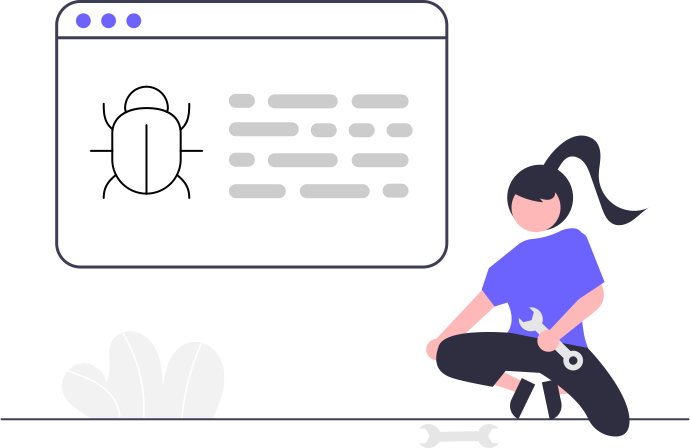

# Meerkat Engine III Layer
At the last layer Meerkat perform the most complex 
scans and predictions.   
The main idea of the third layer is 
dynamic analysis of the program behavior during runtime.  

## System and Memory scanning
  
Module responsible for the system and memory fuzzing use American Fuzzy Loop (AFL++) to find undefinied / undocumented behavior in code flow and unusual values in memory.  
For example fuzzing can detect undocumented  functions that performs abnormal behavior like file encryption or steal user data. 

## Network scanning
  
Network module is responsible for the dynamic network hypervisoring, and it's devided into two parts dedicated native and web applications.  
   

### Native applications  
In the native solutions we are focused on the scanning income and outcome packages especially:
- Content
- Source
- Destination
- Protocol
- Relation between sent packages   

Set of the complex algorithms and Artificial Intelligence trained on the malware samples will detect unusual behavior and report supposed incident.

### Web applications
In the web application we are focused on the API endpoint fuzzing and studying application behavior.

 

## Cloud integration   
  
   
These days, most of the companies use cloud solutions.
Growing popularity of the cloud microservice architecture creates the field for the new and more sophisticated attack technics that APT groups can use against companies.
To solve this problems everything what you need to do is connect Meerkat Cloud Module to your cloud solution.    

Meerkat will be verifying: 
- Terraform scripts  
- SNS / SQS messages
- queries to S3 buckets   
- queries to Aurora database   
and more!
